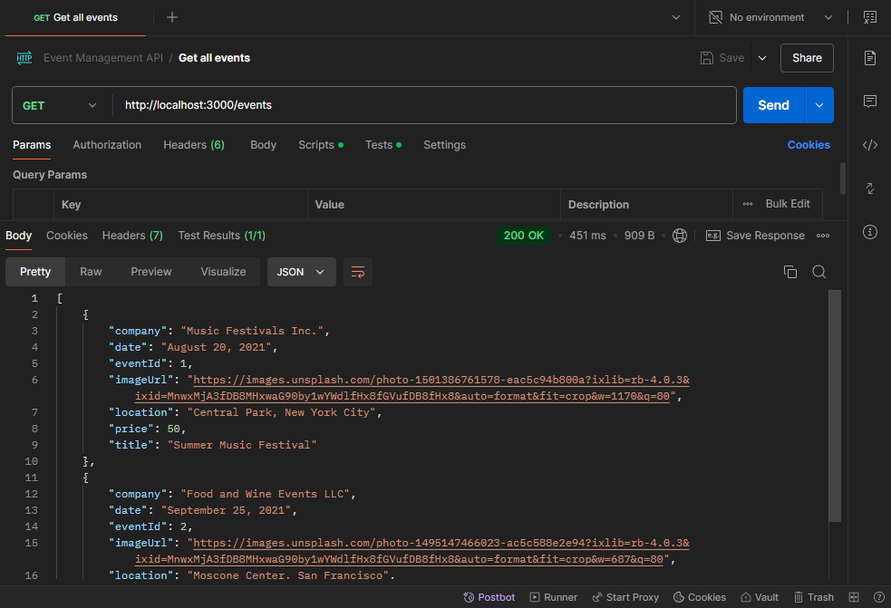
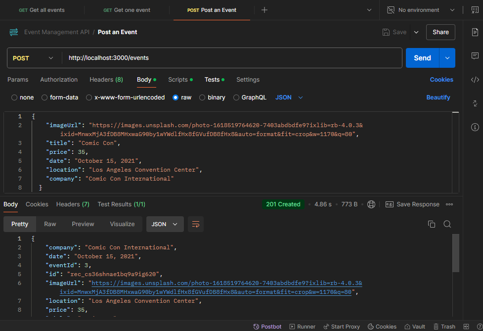
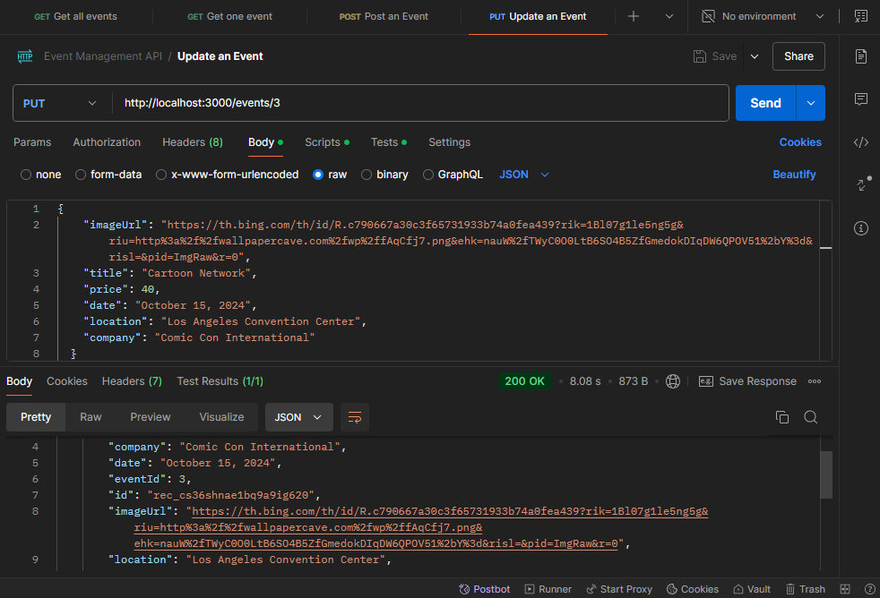
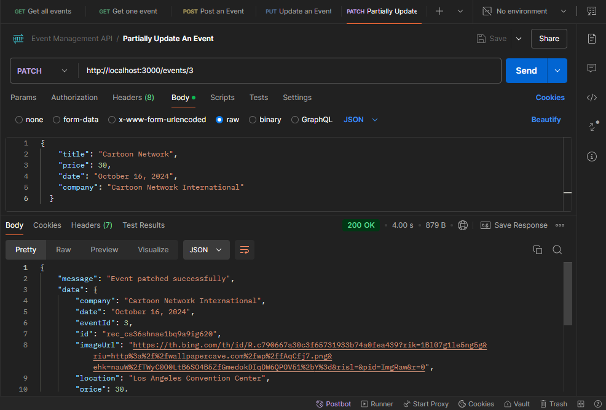
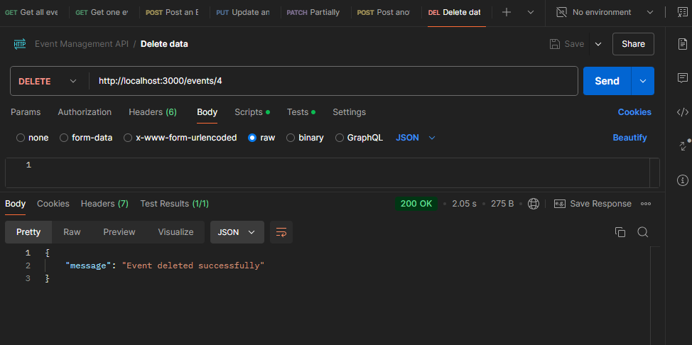
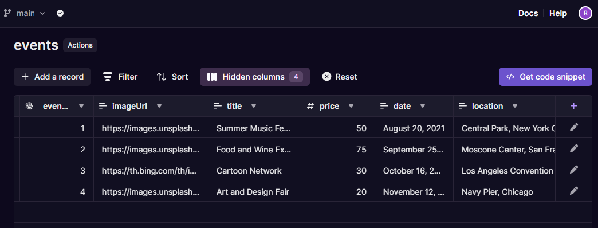

# Event Management API

## Description

This repository contains an Event Management API built with Express.js and Xata. The API allows you to create, read, update, and delete events in a database.

## Setup Instructions

1. Install dependencies:
    ```sh
    pnpm install
    ```

2. Create a `.env` file in the root directory and add your environment variables:
    ```env
    DATABASE_URL=<your-database-url>
    XATA_BRANCH=<your-xata-branch>
    ```

3. Start the server:
    ```sh
    pnpm run dev
    ```

## API Documentation

### GET /events

Retrieves all events from the database.

#### Request
- Method: `GET`
- URL: `/events`

#### Response
- Status: `200 OK`
- Body: Array of event objects

#### Example


### POST /events

Creates a new event in the database.

#### Request
- Method: `POST`
- URL: `/events`
- Body:
    ```json
    {
        "company": "Company Name",
        "date": "2023-10-01",
        "imageUrl": "http://example.com/image.png",
        "location": "Location",
        "price": 100.0,
        "title": "Event Title"
    }
    ```

#### Response
- Status: `201 Created`
- Body: Created event object

#### Example


### PUT /events/:eventId

Updates an existing event by `eventId`.

#### Request
- Method: `PUT`
- URL: `/events/:eventId`
- Body:
    ```json
    {
        "company": "Updated Company Name",
        "date": "2023-10-02",
        "imageUrl": "http://example.com/updated-image.png",
        "location": "Updated Location",
        "price": 150.0,
        "title": "Updated Event Title"
    }
    ```

#### Response
- Status: `200 OK`
- Body: Updated event object

#### Example


### PATCH /events/:eventId

Partially updates an existing event by `eventId`.

#### Request
- Method: `PATCH`
- URL: `/events/:eventId`
- Body:
    ```json
    {
        "price": 200.0
    }
    ```

#### Response
- Status: `200 OK`
- Body: Updated event object

#### Example


### DELETE /events/:eventId

Deletes an event by `eventId`.

#### Request
- Method: `DELETE`
- URL: `/events/:eventId`

#### Response
- Status: `200 OK`
- Body: Success message

#### Example


## Database Schema

The database schema for the events table is as follows:

- `company`: text
- `date`: text
- `eventId`: int (unique)
- `imageUrl`: text
- `location`: text
- `price`: float
- `title`: text
- `xata_createdat`: datetime (not null, default: now())
- `xata_id`: text (not null, unique, default: ('rec_'::text || (xata_private.xid())::text))
- `xata_updatedat`: datetime (not null, default: now())
- `xata_version`: int (not null, default: 0)

## Database Table

The database table is as follows:

